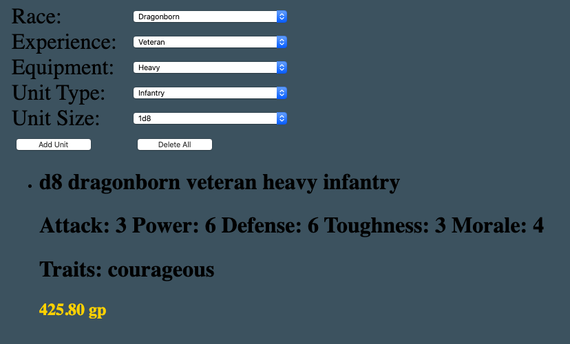
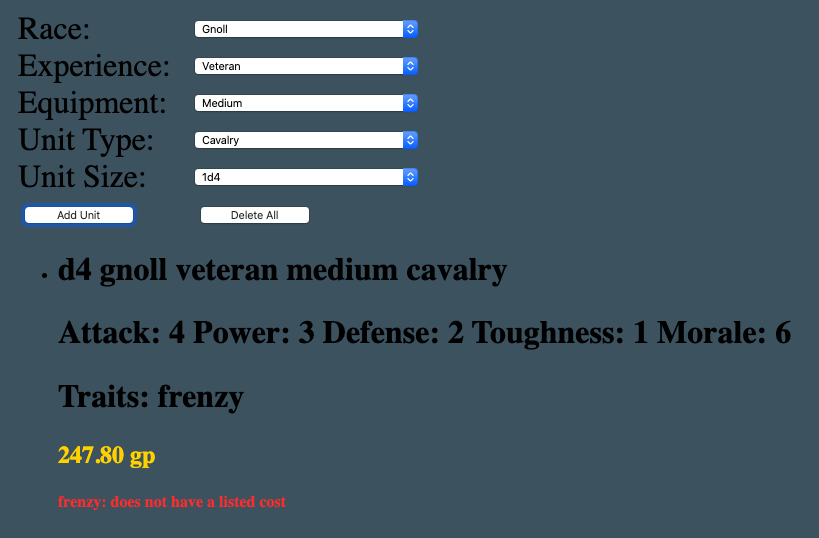
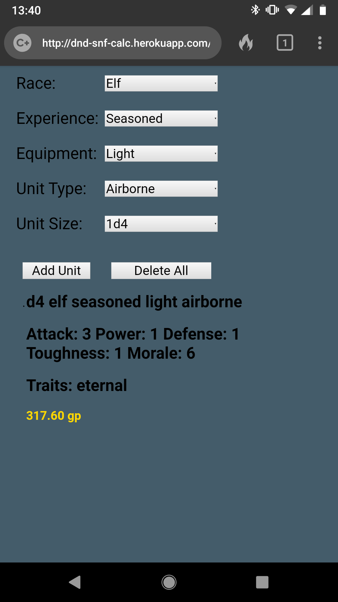
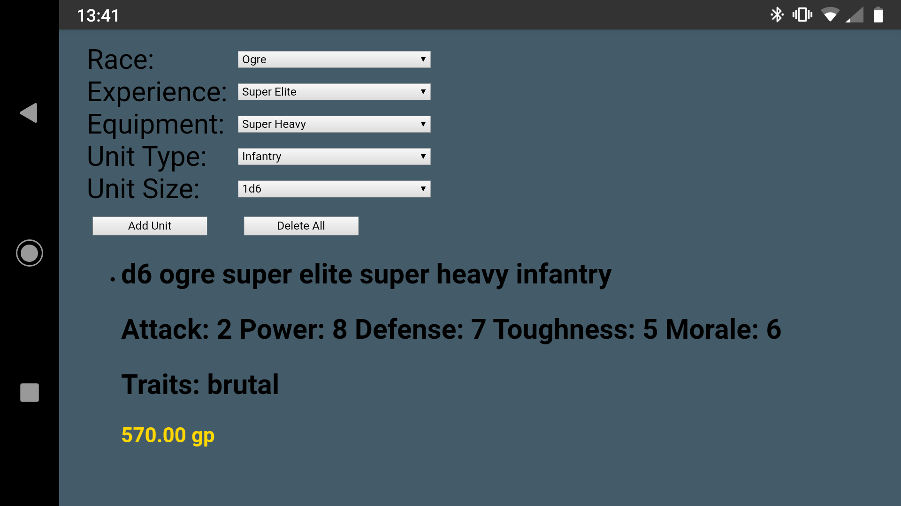

## D&D - Strongholds and Followers unit cost calculator

[See the live project](https://dnd-snf-units.fraserkeir.com/)

This app was is designed to simplify the creation of units using Matt Colville's Strongholds and Followers sourcebook. It was created after a long D&D session, where this process was slowing gameplay.

The project was built in a single sitting of ~3 hours, with later styling to make it easier to use. 

It is now used regularly in our games.



The app is comprised of multiple drop-down menus containing properties which describe each unit. These properties are used to calculate the game statistics and cost of a unit. Once a unit has been calculated and displayed, it is added in a list view. This allows multiple units to be easily compared, and decisions made.

The dataset used in the published version of the book is incomplete; the racial traits are not all given a gold value. These traits are given a value of 0 gp and raised in red, so that the players can make a decision during the game.



Since most games take place in person, using pen and paper, it was important that the app looked good and worked on mobile. A CSS media query was used to control the mobile view styling.

<p float="left">
	
	
</p>

### Getting started

#### Using the project
The app is written in JavaScript. Once you download the project, you can open the index.html in the browser and you're ready to go!

### Unit Creation
Each selected property of a unit has game stats associated with it. `sumModifier()` uses the reduce enumerator on the array `components`, to get the total value of the stats provided from each property. The `traits` are pulled directly from the race `traits`. `typeMulti` is a multiplier used in the cost calculation and is tied to the `unitSize` and `unitType`.

```javascript
  unit = {
    name: `${unitSize} ${race} ${experience} ${equipment} ${unitType}`,
    attack: sumModifier("attack", components),
    power: sumModifier("power", components),
    defense: sumModifier("defense", components),
    toughness: sumModifier("toughness", components),
    morale: sumModifier("morale", components),
    traits: races[race]["traits"],
    typeMulti:
    unitTypes[unitType]["costMulti"] * unitSizes[unitSize]["costMulti"] * 10
  }
 ```
 
#### Cost calculation
The cost calculation is not particularly difficult but it has a lot of pieces which can easily slow gameplay. It sums the units stats and then combines these with a few modifiers.


```javascript
const calculateCost = function (unit){
   let result = unit.attack + unit.power + unit.defense + unit.toughness + 2*unit.morale;
   result *= unit.typeMulti;
   result += 30;
   result += sumTraitValues(unit.traits);
   return result;
};
```

#### Error handling: missing trait
This method checks that each trait, that a unit possesses, is in the full list of traits. If a trait is not there, a warning is added to be displayed for the users.


```javascript
const sumTraitValues = function(traitsArray){
  return traitsArray.reduce((sum, trait) => {
    if (!traits.hasOwnProperty(trait)) {
      traits[trait] = {cost: 0, warning: "does not have a listed cost"};
    }
    return sum += traits[trait]["cost"]
  }, 0)
}
```

### Improve readability: generate element
This method handles the creation, content, and appending of an element. It is used to add each element of a unit's description to its list item.

```javascript
const generateElement = (container, tag, content='') => {
  const element = document.createElement(tag);
  element.textContent = content;

  container.appendChild(element);
};
```


### Potential improvements

At the moment, the code is in a single file and quite unwieldy. Ideally it would be refactored to use a database, for example MongoDB, to store the values of the unit properties.

### Features
* Create, calculate, and display units with varying properties
* Easily compare units
* Highlight omissions in the source material to players